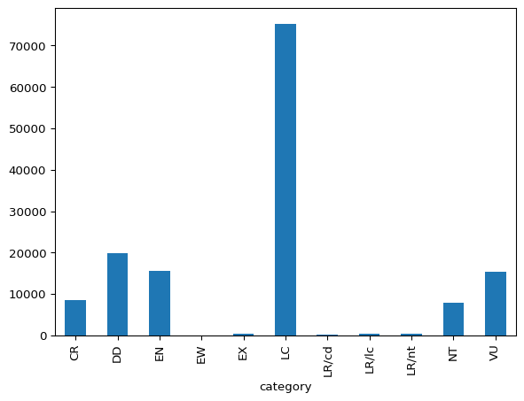

# Threatened Animal Species

Dataset covering [IUCN Red List of Threatened Animal
Species](https://www.iucnredlist.org/).

## Data

### Sample

|       | taxonid  | kingdom_name | phylum_name  | class_name    | order_name  | family_name       | genus_name      | scientific_name          | taxonomic_authority              | infra_rank | infra_name | population | category | main_common_name |
|-------|----------|--------------|--------------|---------------|-------------|-------------------|-----------------|--------------------------|----------------------------------|------------|------------|------------|----------|------------------|
| 54545 | 194793   | PLANTAE      | TRACHEOPHYTA | LILIOPSIDA    | ALISMATALES | ARACEAE           | Cryptocoryne    | Cryptocoryne annamica    | Serebryanyi                      | NaN        | NaN        | NaN        | DD       | NaN              |
| 41480 | 177058   | PLANTAE      | TRACHEOPHYTA | LILIOPSIDA    | POALES      | CYPERACEAE        | Eleocharis      | Eleocharis spiralis      | (Rottb.) Roem. &amp; Schult.     | NaN        | NaN        | NaN        | LC       | NaN              |
| 24736 | 136137   | ANIMALIA     | CHORDATA     | AMPHIBIA      | ANURA       | PHRYNOBATRACHIDAE | Phrynobatrachus | Phrynobatrachus leveleve | Uyeda, Drewes &amp; Zimkus, 2007 | NaN        | NaN        | NaN        | LC       | NaN              |
| 32188 | 162220   | PLANTAE      | TRACHEOPHYTA | MAGNOLIOPSIDA | LAMIALES    | LAMIACEAE         | Sideritis       | Sideritis javalambrensis | Pau                              | NaN        | NaN        | NaN        | VU       | NaN              |
| 80069 | 49254674 | ANIMALIA     | ARTHROPODA   | INSECTA       | ODONATA     | AESHNIDAE         | Neuraeschna     | Neuraeschna dentigera    | Martin, 1909                     | NaN        | NaN        | NaN        | LC       | NaN              |

### Plot

