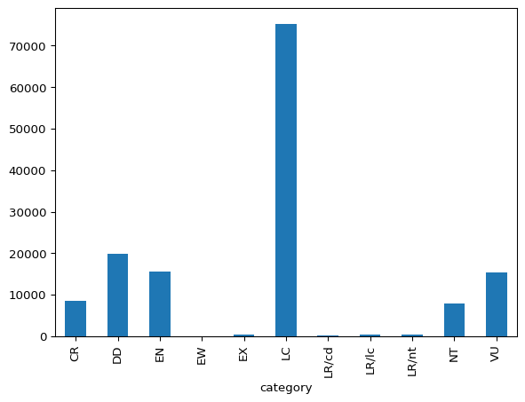

# Threatened Animal Species

Dataset covering [IUCN Red List of Threatened Animal
Species](https://www.iucnredlist.org/).

## Data

There are 143732 species in the dataset that belong to 11 categories.

### Plot

